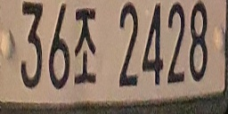

# LicensePlate_Project :car: :blue_car:
[Project] 2021.02 ~ 2021.09 License Plate Detection Application

## Overview
<p align="center">

</p>

***

## 1. 데이터 수집 및 라벨링
차량 번호판 이미지를 직접 수집하여 각 이미지에 대해 '번호판 글자'와 '번호판 네 꼭짓점의 x,y 좌표'를 라벨링 한다.
  
|번호판 이미지|</img>|
|:-:|:-:|
|라벨링|20210210_222919.jpg 1481 2773 2043 2689 2043 2794 1486 2883 36조 2428|

텍스트 파일로 저장된 라벨링 정보는 번호판 네 꼭짓점의 절대 좌표와 번호판 글자를 포함하고 있다. 학습 데이터의 20%를 검증 데이터로 나누어 데이터셋 준비를 마친다. 최종 데이터셋 구성은 다음과 같다.

|학습 데이터|검증 데이터|
|:-:|:-:|
|1635장|409장|

***

## 2. YOLOv5 학습 (Pytorch-YOLOv5)
* 참고: <https://github.com/ultralytics/yolov5>

**1. 인풋 데이터 준비**  
원본 이미지는 번호판 영역을 탐지하기 위해 곧장 YOLO의 입력으로 사용되기 때문에, YOLO의 입력 형식에 맞추기 위해 각 이미지 마다 이미지 파일명과 동일한 이름의 텍스트 파일을 만들어 bounding box의 좌표 정보를 **class, x_center, y_center, width, height**의 포맷의 문자열로 저장한다. 이 때, class를 제외한 나머지 값은 모두 0-1 사이의 **상대 좌표**로 변환한다.

```bash
├── Yolo_input
    ├── train
    │   ├── images
    │   │   ├── 1.jpg
    │ 	│   ├── 2.jpg
    │ 	│  	│     :
    │ 	│  		  
    │   ├── labels
    │	    ├── 1.txt
    │	    ├── 2.txt
    │	   	│     :
    │	
    └── val
 	    ├── images
 	    ├── labels
```

**2. dataset.yaml 준비**  
Custom 데이터셋에 YOLOv5 학습 코드를 그대로 쓸 것이기 때문에, 데이터셋 세팅 부분만 수정한다. dataset.yaml 파일에 학습, 검증 데이터 경로와 객체 클래스 정보를 기입한다. 우리 프로젝트의 경우 탐지하는 객체가 차량 번호판 하나이므로 클래스 라벨을 0으로, 이름을 _\'plate\'_ 로 한다.

**3. YOLO 모델 선택**  
본 프로젝트를 위해 가장 작고 빠른 모델인 YOLOv5s를 사용하였다. 

***

## 3. 꼭짓점 예측 모델 학습

- 사용한 모델 : timm으로 사전학습된 Resnet18 모델을 사용하였다
- 첫 번째 방법

  1. 사용된 이미지 : 네 꼭짓점 좌표값을 이용하여 만든 바운딩 박스에서 각 축으로 1%씩 늘인 이미지

  2. 데이터 증강: 전단 변환(shear transformation), 사진합성, 밝기조절, 리사이즈  
     입력 이미지를 전단 변환 기법을 이용해 x, y축으로 랜덤하게 변환하면 검은색 여백 부분이 생겨, 이 부분을 다른 이미지에서 랜덤하게 가져와 합성시켰다. 이 이미지에 랜덤으로 밝기조절을 추가하여, 128x128 이미지로 리사이즈한 이미지를 모델에 입력으로 넣었다.

  3. 문제점 : 검은색 부분을 다른 사진으로 합성시켰더니 실세계 데이터와 괴리감이 생겨 성능 저하 문제가 발생하였다.  

    |사용된 이미지|데이터증강1|데이터증강2|
    |:-:|:-:|:-:|
    ||||

- 두 번째 방법

  1. 사용된 이미지 : 원본 이미지

  2. 데이터 증강: 전단 변환, 밝기조절, 리사이즈
     입력 이미지와 라벨링을 통해 알려진 번호판 꼭짓점의 좌표들을 전단 변환 기법을 이용해 랜덤 값으로 변환한다. 이 이미지에서 번호판의 좌표를 기준으로 margin을 주고, 그 지점으로부터 랜덤하게 좌표를 찍어 이미지를 자른 것을 사용. 이렇게 하면 첫 번째 방법에서 나왔던 검은 여백 부분이 나오지 않으므로 실세계 데이터와 더 근접하다. 이 이미지에 랜덤으로 밝기조절을 추가하여, 128x128 이미지로 리사이즈한 이미지를 모델에 입력으로 넣었다.

    |사용된 이미지|데이터증강1|데이터증강2|
    |:-:|:-:|:-:|
    ||||
  
  
- Output : 상하좌우 네 꼭짓점에 대한 X,Y 상대좌표

***

## 4. 글자 예측 모델 학습

- 사용한 모델 : timm으로 사전학습된 Resnet18 모델을 사용하였다
- 첫 번째 방법

  1. 사용된 이미지 : 원본 이미지의 네 꼭짓점 좌표에 대한 ground truth를 이용하여 (128, 256)의 크기로 투영변환한 이미지

  2. 데이터 증강: Salt & Pepper 노이즈

  3. 문제점 : 

    |사용된 이미지|데이터증강1|데이터증강2|
    |:-:|:-:|:-:|
    ||||

- 두 번째 방법

  1. 사용된 이미지 : (동희)

  2. 데이터 증강: Salt & Pepper 노이즈, 밝기 조절(전체 밝게, 전체 어둡게, 그림자)

    |사용된 이미지|데이터증강1|데이터증강2|
    |:-:|:-:|:-:|
    ||||
  
  
- Output : 상하좌우 네 꼭짓점에 대한 X,Y 상대좌표
