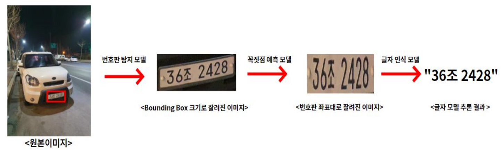
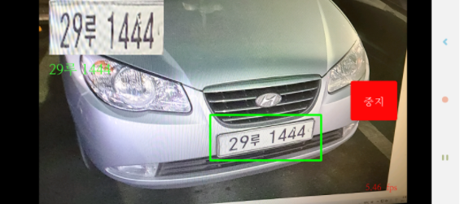

# LicensePlate_Project :car: :blue_car:
[Project] 2021.02 ~ 2021.09 License Plate Detection Application

## Overview
<p align="center">

</p>

***

## 1. 데이터 수집 및 라벨링
차량 번호판 이미지를 직접 수집하여 각 이미지에 대해 '번호판 글자'와 '번호판 네 꼭짓점의 x,y 좌표'를 라벨링 한다.
  
|번호판 이미지|</img>|
|:-:|:-:|
|라벨링|20210210_222919.jpg 1481 2773 2043 2689 2043 2794 1486 2883 36조 2428|

텍스트 파일로 저장된 라벨링 정보는 번호판 네 꼭짓점의 절대 좌표와 번호판 글자를 포함하고 있다. 학습 데이터의 20%를 검증 데이터로 나누어 데이터셋 준비를 마친다. 최종 데이터셋 구성은 다음과 같다.

|학습 데이터|검증 데이터|
|:-:|:-:|
|1635장|409장|

***

## 2. YOLOv5 학습 (Pytorch-YOLOv5)
* 참고: <https://github.com/ultralytics/yolov5>

* 인풋 데이터 준비   
원본 이미지는 번호판 영역을 탐지하기 위해 곧장 YOLO의 입력으로 사용되기 때문에, YOLO의 입력 형식에 맞추기 위해 각 이미지 마다 이미지 파일명과 동일한 이름의 텍스트 파일을 만들어 bounding box의 좌표 정보를 **class, x_center, y_center, width, height**의 포맷의 문자열로 저장한다. 이 때, class를 제외한 나머지 값은 모두 0-1 사이의 **상대 좌표**로 변환한다.

```bash
├── Yolo_input
    ├── train
    │   ├── images
    │   │   ├── 1.jpg
    │ 	│   ├── 2.jpg
    │ 	│  	│     :
    │ 	│  		  
    │   ├── labels
    │	    ├── 1.txt
    │	    ├── 2.txt
    │	   	│     :
    │	
    └── val
 	    ├── images
 	    ├── labels
```

* dataset.yaml 준비    
Custom 데이터셋에 YOLOv5 학습 코드를 그대로 쓸 것이기 때문에, 데이터셋 세팅 부분만 수정한다. dataset.yaml 파일에 학습, 검증 데이터 경로와 객체 클래스 정보를 기입한다. 우리 프로젝트의 경우 탐지하는 객체가 차량 번호판 하나이므로 클래스 라벨을 0으로, 이름을 _\'plate\'_ 로 한다.

* YOLO 모델 선택  
본 프로젝트를 위해 가장 작고 빠른 모델인 YOLOv5s를 사용하였다. 

***

## 3. 꼭짓점 예측 모델 학습

- 사용한 모델 : timm으로 사전학습된 Resnet18 모델을 사용하였다
- 첫 번째 방법

  1. 사용된 이미지 : 네 꼭짓점 좌표값을 이용하여 만든 바운딩 박스에서 각 축으로 1%씩 늘인 이미지

  2. 데이터 증강: 전단 변환(shear transformation), 사진합성, 밝기조절, 리사이즈  
     입력 이미지를 전단 변환 기법을 이용해 x, y축으로 랜덤하게 변환하면 검은색 여백 부분이 생겨, 이 부분을 다른 이미지에서 랜덤하게 가져와 합성시켰다. 이 이미지에 랜덤으로 밝기조절을 추가하여, 128x128 이미지로 리사이즈한 이미지를 모델에 입력으로 넣었다.

  3. 문제점 : 검은색 부분을 다른 사진으로 합성시켰더니 실세계 데이터와 괴리감이 생겨 성능 저하 문제가 발생하였다.  

    |사용된 이미지|데이터증강1|데이터증강2|
    |:-:|:-:|:-:|
    ||||

- 두 번째 방법

  1. 사용된 이미지 : 원본 이미지

  2. 데이터 증강: 전단 변환, 밝기조절, 리사이즈
     입력 이미지와 라벨링을 통해 알려진 번호판 꼭짓점의 좌표들을 전단 변환 기법을 이용해 랜덤 값으로 변환한다. 이 이미지에서 번호판의 좌표를 기준으로 margin을 주고, 그 지점으로부터 랜덤하게 좌표를 찍어 이미지를 자른 것을 사용. 이렇게 하면 첫 번째 방법에서 나왔던 검은 여백 부분이 나오지 않으므로 실세계 데이터와 더 근접하다. 이 이미지에 랜덤으로 밝기조절을 추가하여, 128x128 이미지로 리사이즈한 이미지를 모델에 입력으로 넣었다.

    |사용된 이미지|데이터증강1|데이터증강2|
    |:-:|:-:|:-:|
    ||||
  
  
- Output : 상하좌우 네 꼭짓점에 대한 X,Y 상대좌표

***

## 4. 글자 예측 모델 학습

- 사용한 모델 : timm으로 사전학습된 Resnet18 모델을 사용하였다.
- 첫 번째 방법

  1. 사용된 이미지 : 원본 이미지의 네 꼭짓점 좌표에 대한 ground truth를 이용하여 (128, 256)의 크기로 투영변환한 이미지

  2. 데이터 증강: Salt & Pepper 노이즈
  실제 차량의 번호판은 먼지 및 벌레와 같은 이물질 때문에 얼룩덜룩한 경우가 많다. 따라서 입력 데이터에 랜덤한 노이즈를 추가하여 일반적인 상황까지 커버할 수 있도록 하였다.

  3. 문제점 : 실제 추론 과정에서는 꼭짓점 예측 모델로부터 예측된 꼭짓점 값을 기반으로 정렬된 번호판 이미지가 입력으로 사용되므로, 글자 예측 모델의 성능이 꼭짓점 예측 모델의 성능에 큰 영향을 받음을 확인할 수 있었다.

- 두 번째 방법

  1. 사용된 이미지 : 원본 이미지의 네 꼭짓점 좌표를 x,y 방향으로 각각 랜덤하게 이동시킨 후 (128, 256)의 크기로 투영변환한 이미지

  2. 데이터 증강: Salt & Pepper 노이즈, 밝기 조절(전체 밝게, 전체 어둡게, 그림자)
  수집된 데이터셋은 대부분 낮에 찍은 번호판 이미지였기 때문에, 테스트 리포팅 시 야간 이미지에 대해서는 성능이 낮아지는 것을 확인할 수 있었다. 따라서 밝기 조절 및 그림자 추가 증강 기법을 추가하여 여러 환경의 이미지에 대해 강건한 성능을 보이도록 하였다.
  
    |추론 시 실제 입력되는 이미지|첫 번째 방법|두 번째 방법|
    |:-:|:-:|:-:|
    |</img>|</img>|</img>|
    |</img>|</img>|</img>|
    
    데이터 증강의 예시는 다음과 같다.

    |사용된 이미지|데이터증강1|데이터증강2|
    |:-:|:-:|:-:|
    |</img>|</img>|</img>|
  
- Output : (배치사이즈, 7, 45, 1) 모양의 텐서  
7 -> 7글자
45 -> 45개의 가능한 문자 (\['가', '나', '다', '라', '마', '거', '너', '더', '러', '머', '버', '서', '어', '저', '고', '노', '도', '로', '모', '보', '소', '오', '조', '구', '누', '두', '루', '무', '부', '수', '우', '주', '허', '하', '호', '0', '1', '2', '3', '4', '5', '6', '7', '8', '9'\])

***

## 5. pt >> onnx >> pb >> tflite 변환

- YOLOv5  
제공해주는 export.py를 사용해 TensorFlow Lite 파일로 변환한다. 이 때, Non Max Suppression 부분은 TensorFlow Lite로 변환되지 않아 안드로이드 스튜디오 코드를 짤 때 따로 추가하였다. YOLO의 출력으로 나오는 (1, 3024, 6)의 텐서는 3024개의 가능한 바운딩 박스와, 각 바운딩 박스의 x_center, y_center, width, height, confidence, 객체 클래스 정보를 포함하고 있다. 아래 코드는 가능한 3024개의 바운딩 박스 중 가장 큰 confidence 값을 가지는 하나의 바운딩 박스만을 추론의 결과로 만드는 코드이다 (Non Max Suppression).

```java
float max_conf = detectionResult[0][0][4];
        int idx = 0;
        for(int i = 0; i<3024; i++){
            if(max_conf < detectionResult[0][i][4]){
                max_conf = detectionResult[0][i][4];
                idx = i;

            }
        }
```

- 꼭짓점 예측 모델 & 글자 예측 모델  
모델 학습 시, 검증 데이터셋에 대해 가장 높은 정확도를 가지는 모델의 가중치를 onnx 파일로 저장하고, tflite_converter.py를 통해 최종적으로 어플리케이션 상에서 모델을 로드할 때 쓰이는 TensorFlow Lite 파일로 변환한다.

***

## 6. 안드로이드 어플리케이션 제작

어플리케이션에 앞서 만든 학습된 모델들을 사용하기 위해서는 각 모델에 대한 추론 코드를 만들고, 이를 안드로이드 스튜디오의 MainActivity에 불러와서 사용해야 한다. 우리는 YOLOv5(DHDetectionModel.java), 꼭짓점 예측(AlignmentModel.java), 글자예측(CharModel.java) 이 세 가지 모델에 대한 추론 코드를 만들었다. 추론 코드에 사용된 메소드들은 다음과 같다:

* 생성자

    ```java
    DHDetectionModel(Activity activity, Interpreter.Options options)
    AlignmentModel(Activity activity, Interpreter.Options options)
    CharModel(Activity activity, Interpreter.Options options)
    ```
    --> 각 추론 인스턴스를 생성할 때, 모델 인터프리터(mInterpreter)와 모델에 들어가는 입력(mImageData)에 대해서 정의한다.

* 공통적으로 사용된 메소드

    ```java
    MappedByteBuffer loadModelFile(Activity activity)
    ```
    --> tflite 파일을 불러오는 메소드로 인터프리터 생성시에 사용된다.

    ```java
    void convertBitmapToByteBuffer(Bitmap bitmap)
    ```
    --> 추론할때 이미지를 모델에 들어가는 입력 형식인 ByteBuffer의 형태로 바꾸어주는 메소드이다.

* 추론 메소드  
  * DHDetectionModel

    ```java
    float[][] getProposal(Bitmap bm, Mat input)
    ```
    --> 이미지가 입력으로 들어가면 float[2][5] 형태의 정보를 출력한다. 출력값에는 모델이 탐지한 bounding box의 x, y, w, h, confidence에 대한 정보를 담고 있다. Yolov5에 nms가 tflite 형태로 변환되지 않기 때문에 따로 nms 코드를 추가하였다. 
  * AlignmentModel

    ```java
    float[] getCoordinate(Bitmap bitmap)
    ```
    --> DHDetectionModel에서 나온 출력을 이용해 bounding box의 크기로 자른 이미지가 입력으로 들어가면, float[8] 형태의 정보를 출력한다. 출력값에는 모델이 예측한 꼭짓점의 네 좌표의 (x,y)값을 담고있다.
  * CharModel

    ```java
    String getString(Bitmap bm)
    ```
    --> AlignmentModel에서 나온 출력을 이용해 번호판 크기로 이미지를 자른 후 전단변환을 이용해 정면으로 곧게 편 이미지가 입력으로 들어가면, String 형태의 정보를 출력한다. 출력값에는 모델이 예측한 번호판의 글자 정보를 담고있다.
* 추론 속도(FPS) 문제 개선  
  초기에 모든 모델들을 앱에 적용하였을 때, 한 이미지를 처리하는 시간이 너무 오래걸려서 다음과 같은 방법으로 실시간 추론을 가능하게 하였다.
    1. YOLO 입력 이미지 크기 감소 (640, 480) -> (256,192)
    2. GPU 대리자 사용
    3. 멀티스레딩

* 최종 모델별 & 전체 추론시간
  
  
  |모델|추론시간(millisecond)|
  |:-:|:-:|
  |번호판 탐지 모델|45|
  |꼭짓점 예측 모델|82|
  |글자  모델|86|
  
* 어플리케이션 예


    |예시1|예시2|
    |:-:|:-:|
    |||
    

